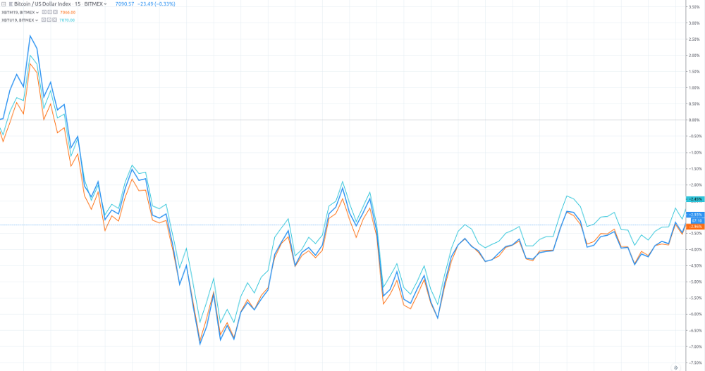

Title: Arbitrage
Author: Nekrasov Pavel
Date: 2018-06-06 15:00
Category: Blog
Tags: trading, arbitrage
Slug: arbitrage
Summary: Here, we will give some detail on how to do real trading using arbitrage. There are always many ways to do so, and the method below is just one of them. But the key ideas are same. 

This post is based on [High Frequency Trading and Probability Theory - Zhaodong Wang](https://scribd.com/document/346123211/High-Frequency-Trading-and-Probability-Theory-Zhaodong-Wang)

"Here, we will give some detail on how to do real trading using arbitrage.
There are always many ways to do so, and the method below is just one of
them. But the key ideas are same."

1. Because arbitrage usually traded on several different instruments, the
    first thing to do is to define a pseudo instrument, which is a combination of
    instruments. Then, we calculate the market data of this pseudo instrument.
    Lets go to the calendar spread example for XBT Futures on BitMEX. Because we hope to
    trade on the difference of XBTH18 and XBTM18( XBTH18 refers to XBT(Bitcoin), 
    Expiration month — H (march), M(june) [https://www.bitmex.com/app/seriesGuide/XBT](https://www.bitmex.com/app/seriesGuide/XBT)),
    we use this definition of the combination. Suppose that the data below is the 
    current market data of these two instruments.
    
    | Instrument ID | Last Price    | Bid Price  | Bid Volume | Ask Price | Ask Volume
    | ------------- |:-------------:| -----:|-----:|-----:|-----:|
    | 1. (XBTM18)     | 8300.5 | 8288.0 | 33 | 8300.0 | 5000
    | 2. (XBTH18)     | 8130.0 | 8101.5 | 150 | 8103.0 | 13212
    
    There we use top of order book data for example.
    
    Now we should consider the suitable market data for the combination, lets call it C. 
    For the last price, it should be the trade price of the last trade, and for the
    combination, it should be the difference of the last trade between these two
    instruments. Therefore, it should be 8300.5 - 8130.0 = 170.5
    
    ```
    combined_instr_last_price = instr[1].last_price - instr[2].last_price
    ```
    
    Now we should consider the bid price and ask price. If we want to buy
    a lot of the combination, we should buy 1 lot of XBTM18 and sell 1 lot of
    XBTH18. To sell 1 lot of combination means to sell 1 lot of XBTM18 and buy
    1 lot of XBTH18. So we need to create pseudo lot function for each trade.
    
    The bid price of the combination should be the price of
    selling 1 lot of combination using the counterparty price, which means to
    sell 1 lot of XBTM18 and to buy 1 lot of XBTH18 both using the counterparty
    prices, and these prices should be the bid price of XBTM18 and the ask price of
    XBTH18. Therefore, the bid price of the combination should be the difference
    between them, that is: 8288.0 - 8103.0 = 185.0
    
    ```
    combined_instr_bid_price = instr[1].bid_price - instr[2].ask_price
    ```
    
    In the same way, the ask price of the combination should be 8300.0 - 8101.5 = 198.5
    
    ```
    combined_instr_ask_price = instr[1].ask_price - instr[2].bid_price
    ```
    
    Then we should calculate the bid volume and ask volume. The bid
    volume should be the maximum volume we can sell on the counterparty
    price at that time. Consider the combination: How many lots can we
    sell at 186.5? It should be the minimal of bid volume of XBTM18 and ask
    volume of XBTH18, that is min{33, 13212} = 33. And the ask volume should be
    min{5000, 150} = 150.
    
    ```
    combined_instr_bid_vol = min(instr[1].bid_volume, instr[2].ask_volume)
    ```
    
    ```
    combined_instr_ask_vol = min(instr[1].ask_volume, instr[2].bid_volume) 
    ```
    
    Therefore, the current market data of combination should be as follows:
    
    |Last Price | Bid Price | Bid Volume | Ask Price | Ask Volume
    | --------- |:---------:| -----:|-----:|-----:|
    |170.5 | 185.0 | 33 | 198.5 | 150
    
    Based on this calculation, we have a new market data for the combination:
    all the fields have a similar meaning for a single instrument. Then, we can
    do analysis and trading based on this market data, just as if it were a normal
    single instrument. 
    
    We can scale with the same technique into depth of order book. 
    
2. Arbitrage combination and price averaging. 
    There are some ways to find a suitable arbitrage
    combination. 
    
    The first is using some knowledge of economics or industry
    to find a potential combination, like the calendar spread, cross-market and
    cross-product arbitrage we have mentioned.
    
    The other way is just to hunt through the numerous market data and find a stable combination, and then
    try to make an explanation of it.
    
    The second technique is now a typical one for modern trading.
    After finding a combination, we should make a decision about the buy or
    sell price for this combination. The most popular way to decide is to utilize
    some kind of average history of the prices of the combination market data.
    We can base our decision on the average of the last prices, or the counterparty
    price in the different market. We can use a short period market data to
    calculate, or use a longer period one. A short period may be helpful for not
    relying so much on a stable arbitrage, such as cross-product combination,
    and a long period can be used for more stable arbitrage, such as calendar
    spread. And there are still several average methods we can choose to
    use: arithmetic average, value-added average or moving average. All these
    methods may be effective. The best method can be found only through deep
    analysis on real market data.
    
3. Trading processes types are, removal and passive.
   
    **Removal** means to always take the counterparty price for all the legs.
    One tries to buy on ask price, and sell at bid price. It is similar to using
    combination market data. The problem is that the real orders are based on
    each leg; we cannot ensure that these legs are all traded simultaneously. If
    some legs are traded and some are not, normally we may use some deep
    price to trade for these non-traded legs, though we know that it may cause a
    miss, it is still better than keeping unbalanced positions for a long time. For
    some legs, their order book is thick, which means there are many orders in
    their order book continuously. We will not lose a lot if we have a miss on
    them. But legs with thin order books will be very dangerous. There may be
    a large gap behind the best bid or ask price, and a miss will cause serious
    loss. Therefore, one of the most popular practices in the area is to find one
    leg with the thinnest order book, and try to make a trade in this leg first. If
    the trade is made, then we shall try to trade on all other legs with thicker
    order books. In this case, we will not have a very large miss. If this leg
    cannot be traded, we can just cancel the order and do nothing with the other
    legs. We will just lose this opportunity to trade with anything, without any
    miss at all. This will be a safer way. Normally, we can predict the thickness
    of the order book by studying the market, and in most cases, the difference
    is very obvious. In some cases, we can detect the thickness in trading time,
    and make the decision on the first trading leg based on it.
  
    **Passive** trading is to place orders at the desired price in order book, and
    wait for counterparties to trade with them. While participating in arbitrage,
    we can only do passive trading in one leg, and after trading, remove all
    other legs. We can do so at any leg of the combination, but similar to the
    consideration of removal, we would better be passive in the leg with thinnest
    order book. There are many kinds of refinement for passive trading. Some
    are focused on getting a better price, some on placing multi-layer orders to
    minimize the time gap between order cancelling, and some on getting better
    time priority for its price level. Traders often give new ideas for these kinds
    of processes based on the understanding of the market microstructure.
    Both removal and passive trading are important processes for arbitrage.
    Removal trading is simple and safe compared with passive trading.
    But passive trading may get a better price than removal, the difference is the
    bid-ask spread of the market data of the leg performing passive trading.And
    passive trading will have much more trading opportunities. But since you
    always put some orders in the exchange, any system problem may cause
    serious result.
    
4. **Calendar spread** requires one to trade on different delivery time periods
    with the same product. It is based on the assumption that the expected
    futures prices for a different delivery time will share the same movement.
    This is true in most cases. For example, index futures are normally quite
    stable for the calendar spread. Below is a graph of 
    XBTM19, XBTU19 and XBT based on 15m market data.
    To get something usefull from this data we manipulate the data 
    to get pseudo instrument derivatives.

    
    
    We can see that the range of the price difference is very narrow, but
    does not stay the same. Therefore, this pair can
    be chosen for generating a good calendar spread strategy. It means that its
    range is not large, so we can predict the price difference in some way. Since
    it still will change some, we can have some opportunities to trade. 
    There is a special kind of calendar spread, called spot-futures spread.
    This type of spread trades spot market versus futures market. For example,
    we can trade some CSI 300 related spot market instruments against IF
    futures, such as some CSI 300 ETFs. Recently, there have been several other ways to trade ETF similar
    to the T + 0 rule, but the high cost is still a problem.

5. **Cross-market arbitrage** refers to the technique in which one finds the
    same or similar products in different markets, and trades between them.
    For example BTC-USD pairs on different exchanges is a cross-market arbitrage. Here, we
    also give a price graph showcasing this arbitrage. We use the market
    data from may 2019, and select BTCUSD from the CEX.io and BTCUSD
    from Bittrex.  The following is the result.
    
    
    
    We can see that this graph is very similar to the graph of the XBT19 calendar
    spread, demonstrating a stable price with a small price movement range.
    This is a typical arbitrage market.
    
6. **Cross-product arbitrage** refers to using the internal relationship
    between several products, and trading among them. Cross-product arbitrage
    is widely used in the securities market in the US and Europe. It assumes that
    they should have a similar performance for similar stocks. This might occur
    because both companies are working in same industry. One may also assume
    that stocks for corporations in one supply chain will have the opposite
    performance if the final market has no change. This kind of arbitrage is
    called alpha arbitrage. In the futures market, cross-product arbitrage is often
    used for products in one step of manufacturing. For example, we know that
    most parts of soybeans are crushed into soybean oil, and the remaining
    part is soybean meal. All these three products are traded in the Dalian
    Commodity Exchange (DCE). Below, we have a graph displaying such a
    combination. According to some domain knowledge of the industry, about
    5 units of soybean can be crushed to 1 unit of soybean oil, and the remaining
    are 4 units of soybean meals. We use the price of soybean oil (y1305), plus
    the price of soybean meal (m1305) multiplied by 4, and subtract the price
    of soybean (a1305) multiplied by 5.
