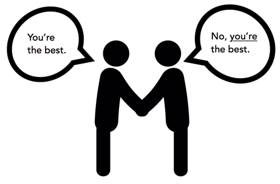

Title: How to get well-developed IT solution
Author: Nekrasov Pavel
Date: 2020-08-29 14:00
Category: Blog
Tags: science, markdown, template 
Slug: business-it-solutions
Summary: In this note we try to understand how to: clarify requirements and determine the importance and urgency

# How to get well-developed IT solution

You can download [raw Markdown file in blog repository on github](https://github.com/nekrasovp/nekrasovp.github.io/blob/master/content/business-it-solutions.md).

## Goal of the note

- Develope better it solution
- Сlarify requirements
- Determine the importance and urgency

## Client-developer relationship

The importance of a culture of client-developer relationship



### Client goals

- **Good**: _You need to ensure a maximum lead time of 30 minutes_
- **Good**: _Inform the client about significant stages of the order_
- **Bad**: _Add the field to the table_

### Developer goals

- **Good**: _We need to use outsource for this task_
- **Good**: _This employee will be underutilized_
- **Bad**: _It's not worth attracting customers this way, no one does like this_

## Developer role
```text
+-----------------------------------------------+
|Company strategy, business goals, markets, etc.|
+------------------------+----------------------+
                         |
                         v
+------------------------+----------------------+
|            Tasks, problems, clients           |
+------------------------+----------------------+
                         |
                         v
+------------------------+----------------------+
|                  IT developer                 |
+------------------------+----------------------+
                         |
                         v
+------------------------+----------------------+
|      Classes, functions, queue, dicts, etc.   |
+------------------------+----------------------+
                         |
                         v
+------------------------+----------------------+
|        Server, code base, ci/cd pipeline      |
+-----------------------------------------------+
```

[Domain-driven design](https://en.wikipedia.org/wiki/Domain-driven_design)

[Awesome Domain-Driven Design](https://github.com/heynickc/awesome-ddd)

[Domain-Driven Design Reference: Definitions and Pattern Summaries  
Eric Evans](https://books.google.ru/books?id=ccRsBgAAQBAJ&lpg=PR1&dq=eric%20evans%202015&hl=ru&pg=PP1#v=onepage&q=eric%20evans%202015&f=false)

[Clean Code: A Handbook of Agile Software Craftsmanship   
Robert C. Martin](https://books.google.ru/books?id=_i6bDeoCQzsC&lpg=PP1&dq=inauthor%3A%22Robert%20C.%20Martin%22&hl=ru&pg=PP1#v=onepage&q&f=false)

## Specification example

### Original assignment

Briefly but succinctly state the prerequisites for creating a product.

### Business opportunities

How solving these problems will help business.

### Business goals

Define countable business goals.

### Success criteria

In which the project will be considered successful

### Vision of the solution

How it will differ from those existing on the market.

### Business risks

Describe the potential problems and risks that are currently understood.

### Assumptions and dependencies

Indicate what important assumptions are accepted as true.

### Main functions

Indicate main system functions without roles.

### MVP

Describe the minimum product, less than which there is no point in making it.

### Versions

Describe at least 2 next versions you intend to release within the product.

### Limitations and exclusions

Describe the deliberate limitations we are aware of.

### Roles

Define all kind of roles involved in product development.

Template for roles definition:

- Value:
- Attitude:
- Interest:
- Restrictions

### Project priority

Describe the project in terms of functions, quality, timing, costs and personnel.

#### Functions

All MVP functionality have to be performed.

#### Quality

All safety tests must be performed. 80% of use cases should be covered by autotests.

#### Timing

The mvp version should be released on _exact date_, maximum delay period is 3 weeks.

#### Costs

Not need to purchase of third-party software or services.

#### Personnel

Estimated team composition: 1 developer, 1 designer, 0.5 tester

### Use cases

Describe product use cases for each involved roles.

One of the most difficult part, add more references!

## DDD Building blocks

1. Entity  
An object that is not defined by its attributes, but rather by a thread of continuity and its identity.  
Example: Most airlines distinguish each seat uniquely on every flight. Each seat is an entity in this context. However, Southwest Airlines, EasyJet and Ryanair do not distinguish between every seat; all seats are the same. In this context, a seat is actually a value object.
2. Value object  
An object that contains attributes but has no conceptual identity. They should be treated as immutable.  
Example: When people exchange business cards, they generally do not distinguish between each unique card; they are only concerned about the information printed on the card. In this context, business cards are value objects.
3. Aggregate  
A collection of objects that are bound together by a root entity, otherwise known as an aggregate root. The aggregate root guarantees the consistency of changes being made within the aggregate by forbidding external objects from holding references to its members.  
Example: When you drive a car, you do not have to worry about moving the wheels forward, making the engine combust with spark and fuel, etc.; you are simply driving the car. In this context, the car is an aggregate of several other objects and serves as the aggregate root to all of the other systems.
4. Domain Event  
A domain object that defines an event (something that happens). A domain event is an event that domain experts care about.
5. Service  
When an operation does not conceptually belong to any object. Following the natural contours of the problem, you can implement these operations in services. See also Service (systems architecture).
6. Repository  
Methods for retrieving domain objects should delegate to a specialized Repository object such that alternative storage implementations may be easily interchanged.
7. Factory  
Methods for creating domain objects should delegate to a specialized Factory object such that alternative implementations may be easily interchanged.

## Conclusion

Generated on previous steps artifacts and other software quality attributes define stack and implementation.  

[FURPS: Functionality, Usability, Reliability, Performance, Supportability](https://en.wikipedia.org/wiki/FURPS)

```text
+---------+                                   +---------------------------+
|Artifacts+---+                           +-->+Stack selection            |
+---------+   |   +-------------------+   |   +---------------------------+
              +-->+System architecture+---+
+---------+   |   +-------------------+   |   +---------------------------+
|FURPS    +---+                           +-->+Classes, methods, services,|
+---------+                                   |graphs, integrations       |
                                              +---------------------------+
```