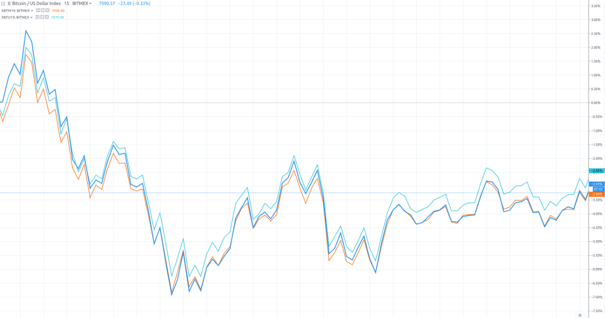

Title: Calendar spread
Author: Nekrasov Pavel
Date: 2018-06-05 15:00
Category: Blog
Tags: trading, calendar spread
Slug: calendar-spread
Summary: Calendar spread requires one to trade on different delivery time periods with the same product. It is based on the assumption that the expected futures prices for a different delivery time will share the same movement

This post is based on [High Frequency Trading and Probability Theory - Zhaodong Wang](https://ru.scribd.com/document/346123211/High-Frequency-Trading-and-Probability-Theory-Zhaodong-Wang)

Calendar spread requires one to trade on different delivery time periods
with the same product. It is based on the assumption that the expected
futures prices for a different delivery time will share the same movement.
This is true in most cases. For example, index futures are normally quite
stable for the calendar spread. Below is a graph of 
XBTM19, XBTU19 and XBT based on 15m market data.
To get something usefull from this data we manipulate the data 
to get pseudo instrument derivatives. Check [Pseudo instrument article](pseudo-instrument.html) for more information.

We can see that the range of the price difference is very narrow, but
does not stay the same. Therefore, this pair can
be chosen for generating a good calendar spread strategy. It means that its
range is not large, so we can predict the price difference in some way. Since
it still will change some, we can have some opportunities to trade. 

There is a special kind of calendar spread, called spot-futures spread.
This type of spread trades spot market versus futures market. For example,
we can trade some CSI 300 related spot market instruments against IF
futures, such as some CSI 300 ETFs. Recently, there have been several other ways to trade ETF similar
to the T + 0 rule, but the high cost is still a problem.

Revisited with new images at may 2019.