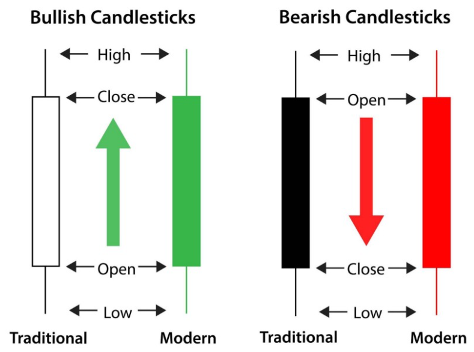

Title: Stock market candlestick charts with plotly and python
Author: Nekrasov Pavel
Date: 2019-07-10 20:00
Category: Blog
Tags: python, notebook, finance, pandas, portfolio
Slug: candlestick-charts-plotly
Summary: This article is the first of a short series on data analysis applied to finance, in which I’ll seek to demonstrate a few useful artifacts used by stock market professionals, data analysts and traders. The whole approach is done using Python.

## Candlesticks Interpretation

Perhaps the most common graphical way of displaying commodities price behavior in a giving time frame, candlestick graphs allows us to get a quick and intuitive perception on the stock’s performance. Each candle represents a specific period of analysis (this article will work with daily periods) and informs the opening and closing prices, as well as it’s highs and lows.



The so called “body” of the candle, represented by the thicker area between the opening and closing values, is shown in two different colors — as usual approach: green/white signals a bullish behavior, with the closing price being higher the opening, and red/black demonstrates a bearish behavior, where the price fell lower then it’s opening mark. The third possible case is a “flat-body” type called “doji candles”. This shape of candlestick appears when the active closes at the same (or very near) price that it opened.

At last, the “shadow” of the candle is a line that may be shown in the upper and/or lower part of the candle’s body. When it appears above the body, it represents the period’s highest achieved price. If below the body of the candlestick, the shadow indicates the lowest price stated in that period.

## Building the chart

First things first, we’ll import pandas to set our data frame and plotly for the chart-building work.

```python
import pandas as pd
from pandas.testing import assert_frame_equal
from pandas_datareader import data as web
import plotly.graph_objects as go
import plotly.express as px
```

Note that using plotly chart-studio’s library may be useful if you wish to save your graph in plotly’s dash (also sharing and embledding your graph gets easier by doing so).
Next, we’ll gather our chosen stock’s data from yahoo finance using pandas “datareader” function. For this exercise, we’ll work with AAPL stock, why not?!

```python
df = pd.DataFrame()
stock = 'AAPL'
df = web.DataReader(stock, data_source='yahoo', start='01-01-2010')
```

We can see that the ‘date’ column is already set as our database index and it’s already on datetime format, so we’re good to go!
Regarding our chart’s plot and subplots, we’ll need to define traces. The first trace should establish the main settings of our plot, as follows:

```python
trace1 = {
    'x': df.index,
    'open': df.Open,
    'close': df.Close,
    'high': df.High,
    'low': df.Low,
    'type': 'candlestick',
    'name': 'AAPL',
    'showlegend': False
}
```

From there, our subsequent traces will plot all the analysis tools that we choose. One of the most common metrics are moving averages, which in our example will be set for 30 and 50 periods.

```python
avg_30 = df.Close.rolling(window=10, min_periods=1).mean()
avg_50 = df.Close.rolling(window=50, min_periods=1).mean()
```

It’s important to notice that the averages are calculated over the closing price, and the ‘window’ attribute takes the number of periods that we want to sum to extract the mean value.
From there, we can define the subplots for both the moving averages in traces 2 and 3, using a simple scatter-type line graph and differentiating each other by color. Also, legends will be shown by default.

```python
trace2 = {
    'x': df.index,
    'y': avg_30,
    'type': 'scatter',
    'mode': 'lines',
    'line': {
        'width': 1,
        'color': 'blue'
            },
    'name': 'Moving Average of 30 periods'
}

trace3 = {
    'x': df.index,
    'y': avg_50,
    'type': 'scatter',
    'mode': 'lines',
    'line': {
        'width': 1,
        'color': 'red'
    },
    'name': 'Moving Average of 50 periods'
}
```

By now, we have all we need to plot a candlestick chart that gives us the opening, closing, highest and lowest prices of each daily candle, with also both moving averages lines in it.
We’re almost there! The next step is to aggregate all of the traces into one ‘data’ variable, which will incorporate all of the subplots. Then, we can set our chart’s layout as we please.

```python
data = [trace1, trace2, trace3]
layout = go.Layout({
    'title': {
        'text': 'AAPL',
        'font': {
            'size': 15
        }
    }
})
fig = go.Figure(data=data, layout=layout)
fig.write_html("./AAPL-web.html")
fig.show()
```

<!-- # TODO Add chart-studio links -->
