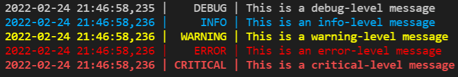

Title: Custom color formatter with Python logging
Author: Nekrasov Pavel
Date: 2022-02-24 21:47
Category: Blog
Tags: python, logging
Slug: color-formatter
Summary: This article explains how to get up and running with custom color fomatter in your logger.

## Contents

- [Contents](#contents)
- [Logging](#logging)
- [The scenario](#the-scenario)
- [The logger](#the-logger)
- [A custom color formatter](#a-custom-color-formatter)
- [Run it](#run-it)

## Logging

There comes a time in the life of a Python package when proper logs beat *print()* ing to standard output. The standard Python library offers the versatile [logging](https://docs.python.org/3/library/logging.html) module.

This article explains how to get up and running with logging. You basically have the choice between the basic logging configuration and creating your own custom logger, more easily adapted to meet your specific requirements.

## The scenario

Let us suppose you need to log both to standard output and to a file. Furthermore, you want your console output to be colored. If your intention is to avoid bringing new dependencies to your project (otherwise you’d use *loguru*, or at the very least *colorama*), you can do this with a bare-bones custom [logging.Formatter](https://docs.python.org/3/library/logging.html#logging.Formatter) class and with [ANSI escape codes](https://www.lihaoyi.com/post/BuildyourownCommandLinewithANSIescapecodes.html).

## The logger

Here is what your logger might look like:

```python
import logging
import datetime

# Create custom logger logging all five levels
logger = logging.getLogger(__name__)
logger.setLevel(logging.DEBUG)

# Define format for logs
fmt = '%(asctime)s | %(levelname)8s | %(message)s'

# Create stdout handler for logging to the console (logs all five levels)
stdout_handler = logging.StreamHandler()
stdout_handler.setLevel(logging.DEBUG)
stdout_handler.setFormatter(CustomFormatter(fmt))

# Create file handler for logging to a file (logs all five levels)
today = datetime.date.today()
file_handler = logging.FileHandler('my_app_{}.log'.format(today.strftime('%Y_%m_%d')))
file_handler.setLevel(logging.DEBUG)
file_handler.setFormatter(logging.Formatter(fmt))

# Add both handlers to the logger
logger.addHandler(stdout_handler)
logger.addHandler(file_handler)
```

## A custom color formatter

For building our own custom formatter, we will extend the *logging.Formatter* class, give it the log format we want, and instruct it to print out each message level in a distinct color. ANSI escape codes for 8-color, 16-color and 256-color terminals may be found [here](https://www.lihaoyi.com/post/BuildyourownCommandLinewithANSIescapecodes.html).

```python
class CustomFormatter(logging.Formatter):
    """Logging colored formatter, adapted from https://stackoverflow.com/a/56944256/3638629"""

    grey = '\x1b[38;21m'
    blue = '\x1b[38;5;39m'
    yellow = '\x1b[38;5;226m'
    red = '\x1b[38;5;196m'
    bold_red = '\x1b[31;1m'
    reset = '\x1b[0m'

    def __init__(self, fmt):
        super().__init__()
        self.fmt = fmt
        self.FORMATS = {
            logging.DEBUG: self.grey + self.fmt + self.reset,
            logging.INFO: self.blue + self.fmt + self.reset,
            logging.WARNING: self.yellow + self.fmt + self.reset,
            logging.ERROR: self.red + self.fmt + self.reset,
            logging.CRITICAL: self.bold_red + self.fmt + self.reset
        }

    def format(self, record):
        log_fmt = self.FORMATS.get(record.levelno)
        formatter = logging.Formatter(log_fmt)
        return formatter.format(record)
```

## Run it

```python
logger.debug('This is a debug-level message')
logger.info('This is an info-level message')
logger.warning('This is a warning-level message')
logger.error('This is an error-level message')
logger.critical('This is a critical-level message')
```



The ANSI escape codes can obviously be substituted with [colorama](https://pypi.org/project/colorama/), if extra dependencies are not an issue.
