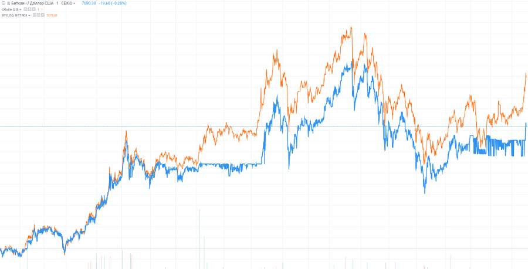

Title:Cross-market arbitrage
Author: Nekrasov Pavel
Date: 2018-06-05 15:00
Category: Blog
Tags: trading, arbitrage
Slug: cross-market-arbitrage
Summary: Cross-market arbitrage refers to the technique in which one finds the same or similar products in different markets, and trades between them.

Cross-market arbitrage refers to the technique in which one finds the
same or similar products in different markets, and trades between them.
For example BTC-USD pairs on different exchanges is a cross-market arbitrage. Here, we
also give a price graph showcasing this arbitrage. We use the market
data from may 2019, and select BTCUSD from the CEX.io and BTCUSD
from Bittrex.  The following is the result.

We can see that this graph is very similar to the graph of the XBT19 calendar
spread, demonstrating a stable price with a small price movement range.
This is a typical arbitrage market.

Revisited with new images at may 2019.