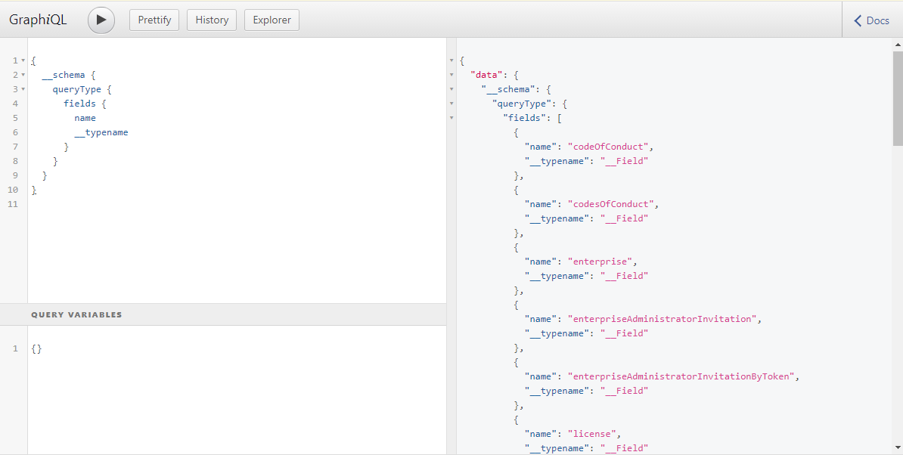

Title: Understand GraphQL Schema
Author: Nekrasov Pavel
Date: 2020-11-29 14:00
Category: Blog
Tags: graphql
Slug: graphql-schema
Summary: In this note, we will discuss what is a GraphQL schema and different ways to retrieve the GraphQL schema from a GraphQL server

# Understand GraphQL Schema

- [Understand GraphQL Schema](#understand-graphql-schema)
  - [Goal of the note](#goal-of-the-note)
  - [Glossary](#glossary)
  - [Definition of a GraphQL Schema](#definition-of-a-graphql-schema)
  - [The Importance of the GraphQL Schema](#the-importance-of-the-graphql-schema)
  - [How To Get The Schema — GraphQL Explorer](#how-to-get-the-schema--graphql-explorer)
  - [How To Get The Schema — Introspection Queries](#how-to-get-the-schema--introspection-queries)
  - [Hiding the GraphQL Schema](#hiding-the-graphql-schema)
  - [Conclusion](#conclusion)

## Goal of the note

- Describe what is GraphQL schema
- Understand how do we retrieve schema from the GraphQL server
- Hiding the GraphQL Schema

## Glossary

- **GraphQL schema**: A document describing how a GraphQL server is structured.
- **GraphQL query**: A type of request sent to the GraphQL server used to retrieve records.
- **GraphQL mutation**: A type of request sent to the GraphQL server used to create, update, or delete records.
- **GraphQL types**: This is an object that we interact with in the GraphQL schema. An object can be a User, a Message, a Post, etc.

Understand GraphQL types, queries, and mutations. This is an [example](https://www.freecodecamp.org/news/a-beginners-guide-to-graphql-86f849ce1bec/) if you’re just getting started with GraphQL.

## Definition of a GraphQL Schema

A GraphQL schema is a document describing how a specific GraphQL server is structured. A GraphQL schema is like a SQL database design. Every GraphQL server has a schema.

Below is an example of a GraphQL schema:

```js
type Query {
   users: [User]
}

type User {
   id: ID!
   email: String
}
```

In the schema above there is a GraphQL query called users which returns an array of users and a User type with an id and email field.

Every GraphQL server has a schema.

## The Importance of the GraphQL Schema

The GraphQL schema is important for end users because it can provide the following info:

- GraphQL queries we can make to the GraphQL server.
- GraphQL mutations we can make to the GraphQL server.
- A list of GraphQL types.
- What GraphQL types are available to query.
- What GraphQL types are available to mutate (aka create, update, or delete).
- Fields within a GraphQL type. For example, a User type will have a name, email, and bio field.
- Relationships between GraphQL types. For example, a User can have many Friends. A Post can belong to a User.
- Business logic on how the application potentially works. For example, if the Post type has a field called “hidden,” we can implicitly assume that Posts can be hidden from other users. Following this rabbit hole will allow us to understand how features work in the application.

GraphQL schema is important because it provides us structure of the GraphQL server. The next question we must ask then is how do we retrieve this schema from the GraphQL server?

Below are two such ways: the GraphQL Explorer and Introspection Queries.

## How To Get The Schema — GraphQL Explorer

Some GraphQL servers provide a GraphQL Explorer (typically called GraphiQL). The GraphQL Explorer is a page where you can manually input GraphQL queries into the page (see the left pane in example below) and see how the GraphQL server responds (see the right pane in the example below).



You can typically find the link to the application’s GraphQL Explorer in the API documentation.

## How To Get The Schema — Introspection Queries

Some GraphQL servers don’t provide a convenient GraphQL API explorer. Instead, to get the schema we need to send a HTTP request to the GraphQL server endpoint asking for the GraphQL schema. This type of HTTP request is called a **GraphQL introspection query**.

The GraphQL introspection query’s body is made up of GraphQL syntax-text that represents what we are asking the GraphQL server to return.

For example, the following GraphQL syntax-text is asking the GraphQL server to return a list of all queries available to us from the schema:

```json
{
  __schema {
    queryType {
      fields {
        name
      }
    }
  }
}
```

Below are two more GraphQL syntax-text requests you can make to a GraphQL server:

Returns all mutations available to us from the schema:

```json
{
  __schema {
    mutationType {
      fields {
        name
      }
    }
  }
}
```

Returns the entire schema: queries, mutations, fields, etc.:

[GraphQL Endpoint Introspection Query gist](https://gist.github.com/nekrasovp/ef015aceed36065a732b4cebf2e5e8c1)

```json
query IntrospectionQuery {
    __schema {
      queryType { name }
      mutationType { name }
      subscriptionType { name }
      types {
        ...FullType
      }
      directives {
        name
        description
        args {
          ...InputValue
        }
        locations
      }
    }
  }

  fragment FullType on __Type {
    kind
    name
    description
    fields(includeDeprecated: true) {
      name
      description
      args {
        ...InputValue
      }
      type {
        ...TypeRef
      }
      isDeprecated
      deprecationReason
    }
    inputFields {
      ...InputValue
    }
    interfaces {
      ...TypeRef
    }
    enumValues(includeDeprecated: true) {
      name
      description
      isDeprecated
      deprecationReason
    }
    possibleTypes {
      ...TypeRef
    }
  }

  fragment InputValue on __InputValue {
    name
    description
    type { ...TypeRef }
    defaultValue
  }

  fragment TypeRef on __Type {
    kind
    name
    ofType {
      kind
      name
      ofType {
        kind
        name
        ofType {
          kind
          name
        }
      }
    }
  }
```

Below is an example of a CURL request where we ask the GraphQL server to return us every query from the GraphQL schema:

```bash
curl 'https://beta.motu.world/graphql' -H 'Content-Type: application/json' -H 'Accept: application/json' --compressed --data-binary '{"query":"{\n\t__schema{\n queryType {\n fields{\n name\n }\n }\n }\n}"}'
```

By running the above CURL request, we get the following results:

```json
{"data":{
    "__schema":{
        "queryType":{
            "fields":[
                {"name":"activity"},
                {"name":"activities"},
                {"name":"category"},
                {"name":"categories"},
                {"name":"currency"},
                {"name":"currencies"},
                {"name":"itinerary"},
                {"name":"itineraries"},
                {"name":"leg"},
                {"name":"legs"},
                {"name":"like"},
                {"name":"likes"},
                {"name":"provider"},
                {"name":"providers"},
                {"name":"providersProperty"},
                {"name":"providersProperties"},
                {"name":"questionary"},
                {"name":"questionaries"},
                {"name":"review"},
                {"name":"reviews"},
                {"name":"files"},
                {"name":"role"},
                {"name":"user"}
                ]
            }
        }
    }
}
```

## Hiding the GraphQL Schema

The GraphQL schema by default exposes valuable information such as connections between types, accessible fields, etc. Therefore, hiding the GraphQL schema(whether that’s part of the schema or the entire schema) from certain users can be an advantage.

## Conclusion

A GraphQL schema is a document describing how a specific GraphQL server is structured. A GraphQL schema is important because it helps end-users understand how a GraphQL server works.

There are two ways to get the GraphQL schema: accessing an application’s GraphQL Explorer and Introspection Queries. Once we have the schema, we can begin work on further investigating the GraphQL server.
