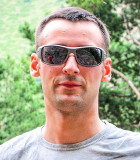

Title: Nekrasov Pavel

##About me

I am a business insider and programmer.

I am a casual author of this blog and a half decent fisherman and snowboarder. I started my way in programming
in 2000, when I was at university, but a few years later, I decided that I should study business processes on 
the other hand and began studying Supply Chain Management with the HSE. In 2017, I became interested in Python full time and here I am.
I am curious about what is happening around me and my family, and I find that my natural tendency
is delving into data sets, trying to find the underlying signals and patterns.
I enjoy all sports particularly snowboarding, football
and running. Love to travel and experience different cultures.