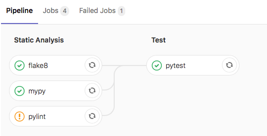
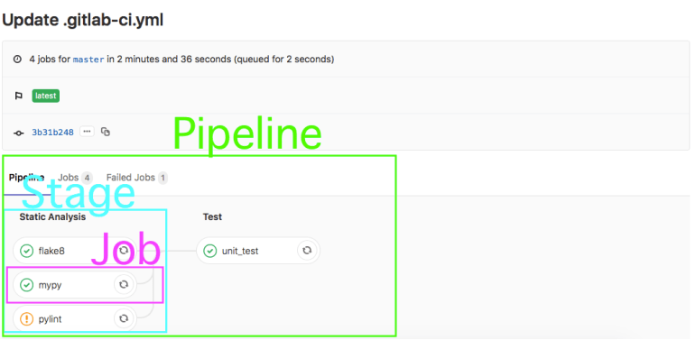

Title: Setting Up GitLab CI for a Python Application
Author: Nekrasov Pavel
Date: 2021-07-10 15:00
Category: Blog
Tags: gitlab, python, mypy, pytest, flake8, pylint
Slug: setting-up-gitlab-ci
Summary: This article describes how to configure a Continuous Integration (CI) process on GitLab for a python application. This article utilizes one of my python applications to show how to setup the CI process.

## Contents

- [Contents](#contents)
- [Abstract](#abstract)
- [What is CI?](#what-is-ci)
- [Getting Started with GitLab CI](#getting-started-with-gitlab-ci)
- [Creating a Single Job in GitLab CI](#creating-a-single-job-in-gitlab-ci)
- [Running Tests with pytest on GitLab CI](#running-tests-with-pytest-on-gitlab-ci)
- [Final GitLab CI Configuration](#final-gitlab-ci-configuration)

## Abstract

This article describes how to configure a Continuous Integration (CI) process on GitLab for a python application. This article utilizes one of my python applications to show how to setup the CI process.



In this article, I’ll show how I setup a GitLab CI process to run the following jobs on a python application:

- Unit and functional testing using pytest
- Linting using flake8
- Static analysis using pylint
- Type checking using mypy


## What is CI?

To me, Continuous Integration (CI) means frequently testing your application in an integrated state.  However, the term ‘testing’ should be interpreted loosely as this can mean:

- Integration testing
- Unit testing
- Functional testing
- Static analysis
- Style checking (linting)
- Dynamic analysis

To facilitate running these tests, it’s best to have these tests run automatically as part of your configuration management (git) process.  This is where GitLab CI is awesome!

## Getting Started with GitLab CI

Before jumping into GitLab CI, here are a few definitions:

- **pipeline**: a set of tests to run against a single git commit.
- **runner**: GitLab uses runners on different servers to actually execute the tests in a pipeline; GitLab provides runners to use, but you can also spin up your own servers as runners.
- **job**: a single test being run in a pipeline.
- **stage**: a group of related tests being run in a pipeline.



GitLab utilizes the ‘.gitlab-ci.yml’ file to run the CI pipeline for each project.  The ‘.gitlab-ci.yml’ file should be found in the top-level directory of your project.

While there are different methods of running a test in GitLab CI, I prefer to utilize a Docker container to run each test.  I’ve found the overhead in spinning up a Docker container to be trivial (in terms of execution time) when doing CI testing.

## Creating a Single Job in GitLab CI

The first job that I want to add to GitLab CI for my project is to run a linter (flake8).  In my local development environment, I would run this command:

```sh
flake8 --ignore=E501 project
```

You can find an accessible description of how to configure flake8 in the official documentation at [Configuring Flake8](https://flake8.pycqa.org/en/latest/user/configuration.html)

This command can be transformed into a job on GitLab CI in the ‘.gitlab-ci.yml’ file:

```yaml
image: "python:3.9-slim"

cache:
  paths:
    - deps_cache
    - venv/


before_script:
  - python --version
  - python -m venv venv
  - source venv/bin/activate
  - pip install -r test-requirements.txt --cache-dir deps_cache

stages:
  - Static Analysis

flake8:
  stage: Static Analysis
  only:
    - master
    - merge_requests
  script:
    - flake8 --ignore=E501 project
```

This YAML file tells GitLab CI what to run on merge request and commits pushed up to master. Let’s break down each section…

The first part (image: “python: 3.9-slim”) instructs GitLab CI to utilize Docker for performing ALL of the tests for this project, specifically to use the ‘python:3.9-slim‘ image that is found on DockerHub.

The second part (cache) ised to specify a list of files and directories to cache between jobs. You can only use paths that are in the local working copy.
Caching is shared between pipelines and jobs. Caches are restored before artifacts.

The third section (before_script) is the set of commands to run in the Docker container before starting each job. This is really beneficial for getting the Docker container in the correct state by installing all the python packages needed by the application.

The fourth section (stages) defines the different stages in the pipeline. There is only a single stage (Static Analysis) at this point, but later a second stage (Test) will be added. I like to think of stages as a way to group together related jobs.

The fourth section (flake8) defines the job; it specifies the stage (Static Analysis) that the job should be part of and the commands to run in the Docker container for this job. For this job, the flake8 linter is run against the project directory.

## Running Tests with pytest on GitLab CI

When I run my unit and functional tests with pytest in my development environment, I run the following command in my top-level directory:

```sh
py.test -v tests
```

This command transformed into a job on GitLab CI in the ‘.gitlab-ci.yml’ file like this:

```yaml
pytest:
  stage: Test
  only:
    - master
    - merge_requests
  script:
    - py.test -v tests --doctest-modules --cov project --cov-report term --cov-report xml
  artifacts:
    paths:
      - coverage.xml
    reports:
      cobertura:
        - coverage.xml

```

In this part of the script we also create coverage report and store it in coverage.xml file

## Final GitLab CI Configuration

Final script which run pylint, mypy, flake8, pytest, coverage and allow failure of Static Analysis stages looks like this:

```yaml
image: python:3.9-slim

cache:
  paths:
    - deps_cache
    - venv/

before_script:
  - python --version
  - python -m venv venv
  - source venv/bin/activate
  - pip install -r test-requirements.txt --cache-dir deps_cache

stages:
  - Static Analysis
  - Test

flake8:
  stage: Static Analysis
  only:
    - master
    - merge_requests
  allow_failure: true
  script:
    - flake8 --ignore=E501 project

pylint:
  stage: Static Analysis
  only:
    - master
    - merge_requests
  allow_failure: true
  script:
    - pylint --fail-under=8 project

mypy:
  stage: Static Analysis
  only:
    - master
    - merge_requests
  allow_failure: true
  script:
  - mypy --ignore-missing-imports project

pytest:
  stage: Test
  only:
    - master
    - merge_requests
  script:
    - py.test -v tests --doctest-modules --cov project --cov-report term --cov-report xml
  artifacts:
    paths:
      - coverage.xml
    reports:
      cobertura:
        - coverage.xml

```

To configure pylint we will use next *.pylintrc* file:

```
[MASTER]

init-hook="from pylint.config import find_pylintrc; import os, sys; sys.path.append(os.path.dirname(find_pylintrc()))"

[MESSAGES CONTROL]

# Disable the message, report, category or checker with the given id(s). You
# can either give multiple identifier separated by comma (,) or put this option
# multiple time (only on the command line, not in the configuration file where
# it should appear only once).
disable=C0103

[DESIGN]

# Maximum number of arguments for function / method
max-args=5

# Maximum number of attributes for a class (see R0902).
max-attributes=10

# Maximum number of boolean expressions in a if statement
max-bool-expr=5

# Maximum number of branch for function / method body
max-branches=12

# Maximum number of locals for function / method body
max-locals=15

# Maximum number of parents for a class (see R0901).
max-parents=7

# Maximum number of public methods for a class (see R0904).
max-public-methods=10

# Maximum number of return / yield for function / method body
max-returns=10

# Maximum number of statements in function / method body
max-statements=50

# Minimum number of public methods for a class (see R0903).
min-public-methods=0

```
Check this resource to find more about pylint messages and they meaning: [PyLint Messages](http://pylint-messages.wikidot.com/)

In this article we didnot cover some intersting techincs like testing against different python version with tox, configuring static analysis tools from 1 source of thuth pyproject.toml file and some other cool features, i will try to cover this in next articles.
