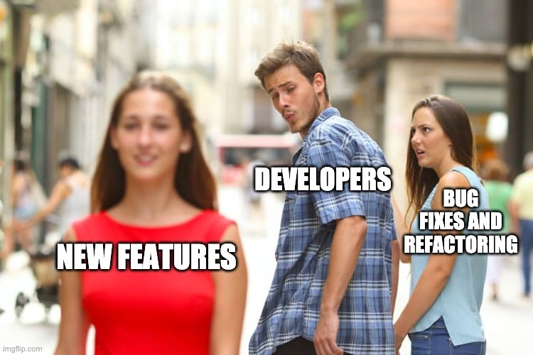

Title: Примеры технического долга
Author: Nekrasov Pavel
Date: 2023-10-14 15:00
Category: Blog
Tags: development, science, workflow
Slug: technical-debt-examples
Summary: В этом посте я хочу более подробно рассмотреть примеры технического долга в существующем коде.

# Примеры технического долга

## Сожержание

- [Примеры технического долга](#примеры-технического-долга)
  - [Сожержание](#сожержание)
  - [Аннотация](#аннотация)
  - [Технический долг в самом коде](#технический-долг-в-самом-коде)
  - [Технический долг в документации](#технический-долг-в-документации)
  - [Другие источники возникновения технического долга](#другие-источники-возникновения-технического-долга)
  - [Что дальше?](#что-дальше)

## Аннотация

В прошлой статье мы дали [определение технического долга][1] и рассмотрели некоторые примеры технического долга в реальной жизни. По [данным Appian][2], 58% организаций согласились с тем, что управление техническим долгом мешает среднему разработчику программного обеспечения разрабатывать приложения, которые нужны их пользователям.

В этом посте я хочу более подробно рассмотреть примеры технического долга в существующем коде. В идеале хорошее понимание различных типов технического долга и того, как он выглядит, может помочь вам избежать его неконтролируемое разрастание.

Ниже приведены примеры технического долга, классифицированные по местам его возникновения.

## Технический долг в самом коде

Существует множество способов создания технического долга и типов технического долга.

Краткое напоминание: технический долг — это долговая метафора, популяризированная Уордом Каннингемом, который [определяет][3] технический долг следующим образом: «С заемными деньгами вы можете сделать что-то раньше, чем в противном случае, но потом, пока вы не вернете эти деньги, вы будете платить проценты. Я думал, что занять деньги — это хорошая идея, я думал, что выбросить программное обеспечение за дверь, чтобы получить некоторый опыт работы с ним, — это хорошая идея, но, конечно, в конечном итоге вы вернетесь назад и, узнав что-то об этом программном обеспечении, вы отплатите за это. кредит путем рефакторинга программы, чтобы отразить ваш опыт, полученный вами». Позже Стив МакКоннелл развил [метафору][4], разделив технический долг на два типа: преднамеренный и непреднамеренный.

Одним из источников технического долга является нарушение правил «чистого кода». Эти правила включают, помимо прочего, правило «один и только один раз». Иногда вы пишете плохой код, который не является модульным, код, модули которого не связаны между собой, код, модули которого называются странно и не соответствуют тому, что они должны делать, или код, который не читается. Иногда вы используете необычные методы кодирования, которые малоизвестны. Иногда вы называете свои переменные, методы и классы не в зависимости от того, что они должны делать.

Иногда вы пишете «уродливый» код или код с «длинными методами, множеством временных переменных, списками параметров, которые передаются в несколько функций, и методами, которые знают о модели данных больше, чем им нужно». [Пишет][5] старший Full Stack инженер Кертис Отери.

Эвальдас, руководитель технической группы Euromonitor International, [написал][6], что его текущая кодовая база является примером технического долга. Базы данных содержат «огромный реляционный монолит» десятилетней давности.

Другой [пример технического долга][7] в коде привел Ипек Озкая, старший сотрудник технического персонала Института разработки программного обеспечения Карнеги-Меллон. Одной успешной компании по производству морского оборудования удалось накопить 3 миллиона строк кода за 16 лет, создав ошеломляющий объем технического долга. С годами на рынок выходили новые компании, сотрудники менялись, и компания выпускала все больше и больше продуктов, на которые в конечном итоге распространяется гарантия или контракты на техническое обслуживание.

Технический долг в системе программного обеспечения значительно замедлил работу команды и потребовал огромного объема работы. Было трудно вносить небольшие изменения или дополнения в продукты, и это часто нарушало код, создавая краткосрочные и долгосрочные трудности. Когда они запускали новые продукты, каждый выпуск требовал от разработчиков нескольких дней ручного и трудоемкого регрессионного тестирования существующих продуктов.

## Технический долг в документации

Одним из крупнейших источников технического долга является недостаточная или устаревшая документация. В идеале разработчики документируют, почему они сделали свой выбор и что они намеревались сделать, как они сгруппировали свои объекты в модули (и почему) и т. д. Также рекомендуется обновлять документацию по мере рефакторинга и добавления в код. .

Обычно техническая задолженность в документации возникает из-за того, что программисты просто действуют слишком быстро и используют ярлыки. Но есть определенные крайние случаи, на которые следует обратить внимание. Например, программист и профессор компьютерных наук Челси Трой отметила один «вопиющий случай» перфекционизма, который привел к технической задолженности в документации. В данном случае Трой взяла на себя управление проектом у разработчика, который объединил все свои пул-реквесты перед тем, как покинуть организацию. Никто ничего не знал о ее проекте, и Трою пришлось восстанавливать контекст проекта с нуля, что обошлось примерно в 30 000 долларов.

Чтобы этого не повторилось, директор попросил разработчика, который, как он подозревал, мог проверять код ушедшего программиста, проверить код Троя. «Этот разработчик уничижительно отзывался о работе и навыках моего предшественника, что дало мне представление об их рабочих отношениях», — [написал][8] Трой. «Когда разработчик начал проверять мою работу, его комментарии касались исключительно вариантов, с которыми он не согласен. Ух ты, неудивительно, что первоначальный разработчик объединил все свои PR».

Неудивительно, что в документации компании по производству морского оборудования также фигурировала техническая задолженность. Новые сотрудники обычно понятия не имели, почему код может сломаться, поскольку документация по проектированию и выбору программ была скудной и устаревшей.

## Другие источники возникновения технического долга

Роберт Лефковиц — бывший главный архитектор Warby Parker. В 2019 году он выступил с [докладом][9] , в котором описал, как решения по управлению проектами могут повлиять на технологический долг. Например, **долг проектирования** часто возникает через сторонние библиотеки, а не только внутри самого кода. «Если вы не хотите технологического долга, избегайте использования библиотек или фреймворков», — сказал Лефковиц. Его примером был React.js. Библиотека, разработанная Facebook, отлично подходит для сложного веб-интерфейса и мобильного интерфейса, которым пользуются миллиарды человек. Но большинство компаний не работают в таких масштабах, поэтому использование React.js замедлит разработку.

Чтобы продемонстрировать, какой технический долг могут добавить внешние библиотеки, Лефковиц удалил все зависимости из примера приложения iOS, включая внешние библиотеки, такие как Alamofire. Это увеличило размер кода с 80 000 до 35 000 строк. Разработчики могут заменить эту функциональность, перейдя на iOS, поскольку она уже понимает HTTP, или переписать ее с нуля.

В результате этого шага потребовалось поддерживать на 45 000 строк кода меньше. Даже если вы импортировали код, когда владелец обновит его, вам придется обновить его в программах, которые его используют. Для дальнейшей количественной оценки выигрыша Лефковиц отметил, что если приложение опирается на 300 зависимостей, а разработчики обновляют каждую из них раз в год, то разработчикам придется пересобирать приложение почти каждый день. Принимая это во внимание, возможно, имеет смысл заново изобрести велосипед, если только вы не создаете проекты, содержащие как минимум 5 миллионов строк кода.

Технический менеджер Ноа Торп выразил это так: «Мы платим арендную плату за каждую строку кода, каждый день». И разработчики также платят арендную плату за свои зависимости. Они могут включать библиотеки и платформы, а также все службы, связанные с вашими приложениями, к которым обычно также подключена библиотека. «Когда вы добавляете библиотеку в свой проект, вы платите арендную плату за всю эту библиотеку и за ее использование», — [написал][11] тренер Nerd Карл Ташиан. «Итак, вам нужно обосновать каждую библиотеку, каждый плагин. Даже крошечные. Они быстро накапливаются. А если вы примените сверхлегкий и дисциплинированный подход, вы будете поражены тем, насколько быстро вы сможете двигаться».

Если предположить, что вам нужны функции Alamofire и теперь вам нужно создать их самостоятельно, удаление Alamofire, например, вероятно, приведет к увеличению технологического долга. В Ruform мы используем React.js, потому что мы достаточно велики и получаем выгоду от совместного использования кода в модулях/компонентах, которые мы можем повторно использовать в нашей кодовой базе, что обычно помогает нам избежать технического долга.

Итог: вообще избегать использования библиотек или фреймворков — не очень хороший совет, но разумно обосновать каждую добавляемую зависимость.

Другой [пример][12] технологического долга за пределами самого кода привел технический директор Redbubble Том Соммер. Они создали свой кластер Kubernetes по индивидуальному заказу еще до того, как появились ныне популярные более управляемые решения, такие как EKS и GKE. Поэтому, прежде чем они могли перейти, им нужно было подумать, как это может повлиять на их приложения и команду.

## Что дальше?

Технический долг живет в самом коде, документации, а также в ваших библиотеках и фреймворках. Надеемся, эти примеры технического долга помогут вам лучше понять, что это такое, как он работает и как его минимизировать в будущем.

[1]: https://nekrasovp.github.io/what-is-technical-debt.html
[2]: https://thenewstack.io/to-reduce-tech-debt-eliminate-dependencies-and-refactoring/
[3]: https://www.productplan.com/glossary/technical-debt/#:~:text=Years%20later%2C%20Cunningham%20described%20how,you'll%20be%20paying%20interest.
[4]: https://www.castsoftware.com/blog/steve-mcconnell-on-categorizing-managing-technical-debt
[5]: https://medium.com/beamdental/refactoring-for-readability-5776cd2d2c22
[6]: https://dev.to/jess/whats-your-worst-technical-debt-story-4ef0
[7]: https://insights.sei.cmu.edu/sei_blog/2019/05/managing-the-consequences-of-technical-debt-5-stories-from-the-field.html
[8]: https://chelseatroy.com/2020/02/21/intercultural-vision-2-passing-as-perfect/
[9]: https://thenewstack.io/to-reduce-tech-debt-eliminate-dependencies-and-refactoring/
[10]: https://github.com/Alamofire/Alamofire
[11]: https://hackernoon.com/managing-technical-debt-1806424e7d40
[12]: https://medium.com/redbubble/depth-first-decision-making-fa347999441b
